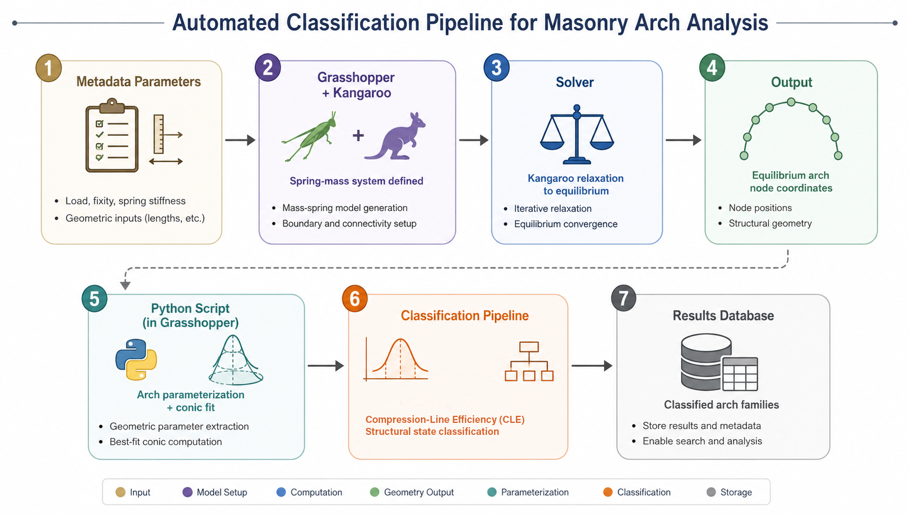

# Computational Form-Finding and the Morphology of Arches

> **From Hooke's Catenary to Parametric Simulation**
>
> Companion data, scripts, and figures repository for the paper targeting *MDPI Buildings* / *MDPI Applied Sciences* — Special Issue on "Computational Design and Digital Fabrication in Architecture."

**Authors:** Shkelqim Sherifi¹\*, 

¹ Department of Architecture, Faculty of Applied Sciences, University of Tetova, North Macedonia
 
**License:** MIT (see [`LICENSE`](LICENSE))

---

## Table of Contents

- [Overview](#overview)
- [Methodology](#methodology)
- [Repository Structure](#repository-structure)
- [Design of Experiments](#design-of-experiments)
- [Classification Pipeline (`classify_arches.py`)](#classification-pipeline-classify_archespy)
- [Data Format](#data-format)
- [Results Summary](#results-summary)
- [Reproducing the Results](#reproducing-the-results)
- [Key Findings](#key-findings)
- [Limitations](#limitations)
- [Citation](#citation)

---

## Overview

This repository contains the full computational pipeline for generating, classifying, and archiving arch morphologies produced by spring-particle system (SPS) form-finding in Rhinoceros/Grasshopper via the Kangaroo 2 physics solver.

The study bridges two previously siloed research strands:

1. **Force-driven form-finding** (Mihajlovska et al. [9]) — Grasshopper/Kangaroo-based simulation verifying that digital force simulation produces accurate equilibrium arch geometry.
2. **Geometric classification** (Saliu et al. [10, 11, 12]) — the "simple states" taxonomy and conic-section classification vocabulary for architectural morphology.

The paper's contribution is the integration: **form is generated by force (via Kangaroo) and subsequently classified geometrically (via conic-section fitting and simple-states tagging)**, producing a unified morphology of arches under physical constraints.

---

## Methodology

The methodology follows a four-stage pipeline: (1) parameter specification, (2) spring-particle form-finding in Grasshopper/Kangaroo, (3) equilibrium geometry export, and (4) Python-based conic-section classification with BIC model selection.



**Figure 1.** Computational methodology pipeline. The workflow begins with metadata parameters (load vector, support condition, spring stiffness, particle count), proceeds through Grasshopper/Kangaroo spring-mass simulation to static equilibrium, exports node coordinates to CSV, and terminates with Python-based conic-section fitting (catenary, parabolic, elliptical) using BIC model selection with shallow-arc and decisiveness safeguards, followed by simple-states semantic tagging.

### Stage 1 — Parameter Specification

The design of experiments varies four parameters across 108 combinations:

| Parameter | Symbol | Values | Role |
|:---|:---:|:---|:---|
| Particle count | N | 12, 24, 48 | Continuum approximation quality |
| Load type | — | uniform, central-point, asymmetric | Controls symmetry of the equilibrium form |
| Load magnitude | g | −0.1, −0.3, −0.5, −0.7 | Gravitational force intensity (negative = downward) |
| Spring stiffness | k | 10, 25, 50 | Elastic restoring force magnitude |

**Support condition:** pinned-pinned (all 108 runs; fixed-pinned and fixed-fixed not executed — see §6.3 of the paper).

### Stage 2 — Spring-Particle Form-Finding (Grasshopper/Kangaroo)

Each arch is discretized into N particles connected by N−1 springs:

- **Particles:** lumped masses with position **x**ᵢ and velocity **v**ᵢ state
- **Springs:** linear elastic connections governed by Hooke's Law: F = k × (l − l₀)
- **Forces:** gravity (uniform, central-point, or asymmetric) applied to all particles

The Kangaroo 2 solver integrates the system forward in time (explicit Euler) until static equilibrium is reached. The resulting particle positions {xᵢ*} define the discovered arch form.

### Stage 3 — Data Export

Equilibrium node coordinates (x, y, z) are serialized to CSV via Grasshopper panel export. Each CSV file represents one parameter combination and is named:

```
arch_run{N}_{loadtype}_g{value}_k{value}.csv
```

where `loadtype` is encoded as: `0` = uniform, `1` = central-point, `2` = asymmetric.

### Stage 4 — Classification (Python)

The Python classification pipeline reads each CSV, fits three candidate geometric models, and selects the best-fitting model via BIC with three safeguards. The full script is included below in [§ Classification Pipeline](#classification-pipeline-classify_archespy).

---

## Repository Structure

```
Computational-Form-Finding-and-Morphology-of-Arches/
│
├── README.md                          ← This file
├── LICENSE                            ← MIT License
│
├── Scripts/
│   ├── classify_arches.py             ← Python classification pipeline (Step 4)
│   ├── GrasshoperScript.gh            ← Grasshopper/Kangaroo form-finding definition (Step 2)
│   ├── results_summary_final.csv      ← Final 108-row classification results
│   ├── code to output all the point combinationas for each arch into csv file.py
│   ├── code to output points for selected arc.py
│   ├── code to generate 3d while rotatin on z axis.py
│   └── code to get GUID.py
│
├── OutputArchPoints/
│   ├── arch_run12_0_g-0.1_k10.0.csv   ← Equilibrium node coordinates (108 files)
│   ├── arch_run12_0_g-0.1_k25.0.csv
│   ├── ...
│   ├── arch_run48_2_g-0.7_k50.0.csv
│   ├── classify_arches.py             ← Working copy (points to this directory)
│   └── results_summary_final.csv      ← Results (same as Scripts/ copy)
│
└── Figures/
    ├── Methodology.png                ← Methodology pipeline diagram (Figure 1)
    ├── arch_classification_pipeline.png     ← Classification flowchart
    ├── arch_classification_pipeline.svg     ← Vector version
    ├── Arch3DGeneration.jpg            ← 3D arch generation from 2D profile
    ├── FORM-FINDING OF ARCHES.jpeg     ← Arch form comparison
    ├── DSC00764.jpg                    ← Physical model photo
    ├── IMG_5393_640.jpg               ← Physical model photo
    └── Screenshot 2026-07-28 *.png     ← Grasshopper canvas screenshots
    └── Screenshot 2026-07-31 *.png     ← Additional screenshots
```

---

## Design of Experiments

**Total: 108 runs** = 3 particle counts × 3 load types × 4 load magnitudes × 3 spring stiffness values

| Factor | Levels | Count |
|:---|:---|:--:|
| Particle count N | 12, 24, 48 | 3 |
| Load type | uniform (0), central-point (1), asymmetric (2) | 3 |
| Load magnitude g | −0.1, −0.3, −0.5, −0.7 | 4 |
| Spring stiffness k | 10, 25, 50 | 3 |
| **Total** | | **108** |

An additional stiffness-verification sweep (k = 1,000, 5,000, 10,000, 50,000 at N = 10, 20, 50) was conducted separately to test the rigid-chain limit — these runs are archived in `OutputArchPoints/` with their original filenames (e.g., `arch_run10.0_0_g-0.1_k10000.0.csv`).

---

## Classification Pipeline (`classify_arches.py`)

The script below is the complete, self-contained classification pipeline used to produce `results_summary_final.csv`. It reads all `arch_run*.csv` files from a directory, fits three candidate conic-section models to each arch's (x, z) profile, and selects the best-fitting model via BIC with three safeguards (ellipse margin guard, decisiveness threshold, shallow-arch flag).

<details>
<summary><b>📄 classify_arches.py — full source (click to expand)</b></summary>

```python
"""
Arch classification pipeline (Step 4 of the methodology).

Reads all arch-run CSVs exported from Grasshopper/Kangaroo2, fits three
candidate geometric models (catenary, parabolic, elliptical) to each arch's
(x, z) profile, picks the best-fitting model via BIC (with an extra
tolerance rule to guard against the elliptical model's known tendency to
win on shallow arcs purely from its extra free parameter), and writes a
summary results table.

USAGE:
    1. Put all your arch_run{N}_{loadtype}_g{val}_k{val}.csv files in one folder.
    2. Edit FOLDER below to point to that folder.
    3. Run:  python classify_arches.py
    4. Look for results_summary.csv in the same folder.

Expected filename format:
    arch_run24.0_0_g-0.1_k10.0.csv
    loadtype code: 0 = uniform, 1 = central_point, 2 = asymmetric

Expected CSV format (as produced by your Grasshopper Python export):
    x,y,z
    0,0,0
    0.416667,0,-0.xxxx
    ...
"""

import os
import re
import glob
import numpy as np
import pandas as pd
from scipy.optimize import curve_fit

# ------------------------------------------------------------------
# 1. CONFIG — change this to your actual folder path
# ------------------------------------------------------------------
FOLDER = r"D:\UT_IT\Conferenca\2026\Architecture\Computational_Form-Finding_of_Arches\testImages"

# Loadtype code -> human-readable label
LOADTYPE_MAP = {
    "0": "uniform",
    "1": "central_point",
    "2": "asymmetric",
}

# How much extra BIC "cushion" the elliptical model must clear over the
# next-best model before it's allowed to win. This guards against the
# known shallow-arc degeneracy where ellipse's extra scale parameter lets
# it out-fit catenary/parabola even when they're the "true" generator.
# Tune this based on your own sensitivity checks; start conservative.
ELLIPSE_BIC_MARGIN = 6.0


# ------------------------------------------------------------------
# 2. CANDIDATE MODELS
# ------------------------------------------------------------------
def catenary(x, a, x0, d):
    """y = a*(cosh((x-x0)/a) - 1) + d
    Reparametrized (peak height d instead of raw offset c) to avoid the
    large-cancellation ill-conditioning that occurs for shallow arches,
    where a and c both blow up but nearly cancel."""
    return a * (np.cosh((x - x0) / a) - 1) + d


def parabola(x, A, x0, c):
    """y = A*(x-x0)^2 + c"""
    return A * (x - x0) ** 2 + c


def ellipse_arc(x, a, b, x0, c):
    """Upper half of an ellipse centered at (x0, c): y = c - b*sqrt(1-((x-x0)/a)^2)"""
    val = 1 - ((x - x0) / a) ** 2
    val = np.clip(val, 0, None)  # guard against tiny negative values from float error
    return c - b * np.sqrt(val)


MODELS = {
    "catenary": (catenary, 3),
    "parabolic": (parabola, 3),
    "elliptical": (ellipse_arc, 4),
}


# ------------------------------------------------------------------
# 3. FIT HELPERS
# ------------------------------------------------------------------
def aic(n, rss, k):
    """Akaike Information Criterion for least-squares fits."""
    if rss <= 0:
        rss = 1e-12
    return n * np.log(rss / n) + 2 * k


def bic(n, rss, k):
    """Bayesian Information Criterion — penalizes extra parameters harder
    than AIC as n grows (k * ln(n) vs a flat 2k), which is what we want
    given the ellipse's extra free scale parameter."""
    if rss <= 0:
        rss = 1e-12
    return n * np.log(rss / n) + k * np.log(n)


def fit_model(name, func, k, x, z):
    span = x.max() - x.min()
    depth = max(z.max() - z.min(), 1e-3)
    x0_guess = (x.max() + x.min()) / 2
    n = len(x)

    ss_tot = np.sum((z - z.mean()) ** 2)

    if name == "catenary":
        # Shallow-arch approximation: a ~ span^2/(8*depth) is the textbook
        # relation between a catenary's shape parameter and its rise. For
        # shallow sags this parameter is nearly non-identifiable (catenary
        # -> parabola as a -> infinity), so a single start can diverge onto
        # a flat ridge. Try several starting magnitudes and keep the best.
        a_base = max(span ** 2 / (8 * depth), span)
        candidates = [a_base * m for m in (0.3, 1, 3, 10, 30)]
        best = None
        for a0 in candidates:
            p0 = [a0, x0_guess, z.max()]
            try:
                popt, _ = curve_fit(func, x, z, p0=p0, maxfev=20000)
                pred = func(x, *popt)
                rss = np.sum((z - pred) ** 2)
                if best is None or rss < best[0]:
                    best = (rss, popt)
            except Exception:
                continue
        if best is None:
            return {"params": None, "rss": np.inf, "r2": float("nan"),
                     "aic": np.inf, "bic": np.inf}
        rss, popt = best
        r2 = 1 - rss / ss_tot if ss_tot > 0 else float("nan")
        return {"params": popt, "rss": rss, "r2": r2,
                 "aic": aic(n, rss, k), "bic": bic(n, rss, k)}

    elif name == "parabolic":
        p0 = [-depth / (span / 2) ** 2, x0_guess, z.max()]
    else:  # elliptical
        p0 = [span / 2, depth, x0_guess, z.max()]

    try:
        popt, _ = curve_fit(func, x, z, p0=p0, maxfev=20000)
        pred = func(x, *popt)
        rss = np.sum((z - pred) ** 2)
        r2 = 1 - rss / ss_tot if ss_tot > 0 else float("nan")
        return {
            "params": popt,
            "rss": rss,
            "r2": r2,
            "aic": aic(n, rss, k),
            "bic": bic(n, rss, k),
        }
    except Exception as e:
        return {"params": None, "rss": np.inf, "r2": float("nan"),
                 "aic": np.inf, "bic": np.inf, "error": str(e)}


def parse_filename(filename):
    """Pull N, loadtype, g, k out of a filename like
    arch_run24.0_0_g-0.1_k10.0.csv
    Returns (N, loadtype_code, loadtype_label, g_val, k_val).
    Any field that fails to parse comes back as None.
    """
    m = re.search(
        r"arch_run(?P<N>-?\d+\.?\d*)_(?P<loadtype>\d+)_g(?P<g>-?\d+\.?\d*)_k(?P<k>-?\d+\.?\d*)",
        filename,
    )
    if not m:
        return None, None, None, None, None

    N = float(m.group("N"))
    loadtype_code = m.group("loadtype")
    loadtype_label = LOADTYPE_MAP.get(loadtype_code, f"unknown({loadtype_code})")
    g_val = float(m.group("g"))
    k_val = float(m.group("k"))
    return N, loadtype_code, loadtype_label, g_val, k_val


def pick_best_model(fits):
    """Select best-fitting model by BIC, with an extra guard: the
    elliptical model only wins if its BIC beats the best non-elliptical
    model by more than ELLIPSE_BIC_MARGIN. This exists because ellipse's
    extra free scale parameter lets it out-fit catenary/parabola on
    shallow arcs even when it isn't the true generator (see discussion
    in chat / paper §6.3 limitations).
    """
    sorted_names =(sorted(fits, key=lambda n: fits[n]["bic"]))
    best_name = sorted_names[0]
    best_bic = fits[best_name]["bic"]
    second_name = sorted_names[1]
    second_bic = fits[second_name]["bic"]

    # Decisive-ness check (conventional rule of thumb: delta < 2 is
    # "not worth more than a bare mention")
    decisive = (second_bic - best_bic) >= 2

    # Ellipse guard: only let ellipse win if it clears the tolerance
    # margin over the best non-elliptical model.
    non_ellipse_best = min(
        (n for n in fits if n != "elliptical"),
        key=lambda n: fits[n]["bic"],
    )
    if best_name == "elliptical":
        margin = fits["elliptical"]["bic"] - fits[non_ellipse_best]["bic"]
        # margin is negative if ellipse's bic is lower (better); we want
        # ellipse to be at least ELLIPSE_BIC_MARGIN points better before
        # trusting it over the guard.
        if -margin < ELLIPSE_BIC_MARGIN:
            best_name = non_ellipse_best
            # Recompute decisiveness against whichever is now second
            remaining = sorted(
                (n for n in fits if n != best_name), key=lambda n: fits[n]["bic"]
            )
            decisive = (fits[remaining[0]]["bic"] - fits[best_name]["bic"]) >= 2

    return best_name, decisive


# ------------------------------------------------------------------
# 4. MAIN LOOP
# ------------------------------------------------------------------
def main():
    csv_paths = sorted(glob.glob(os.path.join(FOLDER, "*.csv")))
    csv_paths = [p for p in csv_paths if os.path.basename(p) != "results_summary.csv"]

    if not csv_paths:
        print(f"No CSV files found in {FOLDER}")
        return

    rows = []
    for path in csv_paths:
        fname = os.path.basename(path)
        df = pd.read_csv(path)
        x = df["x"].to_numpy(dtype=float)
        z = df["z"].to_numpy(dtype=float)

        order = np.argsort(x)
        x, z = x[order], z[order]

        N, loadtype_code, loadtype_label, g_val, k_val = parse_filename(fname)

        fits = {name: fit_model(name, func, k, x, z) for name, (func, k) in MODELS.items()}
        best_name, decisive = pick_best_model(fits)

        span = x.max() - x.min()
        depth = max(z.max() - z.min(), 1e-9)
        shallow_flag = (depth / span) < 0.15  # flag known-degenerate shallow arcs

        row = {
            "file": fname,
            "N": N,
            "loadtype_code": loadtype_code,
            "loadtype": loadtype_label,
            "g_val": g_val,
            "k_val": k_val,
            "n_points": len(x),
            "span": round(span, 4),
            "depth": round(depth, 4),
            "shallow_flag": shallow_flag,
            "best_fit": best_name,
            "decisive": decisive,
        }
        for name in MODELS:
            row[f"{name}_r2"] = round(fits[name]["r2"], 5) if not np.isnan(fits[name]["r2"]) else None
            row[f"{name}_aic"] = round(fits[name]["aic"], 3) if np.isfinite(fits[name]["aic"]) else None
            row[f"{name}_bic"] = round(fits[name]["bic"], 3) if np.isfinite(fits[name]["bic"]) else None

        rows.append(row)
        tag = "" if decisive else "  [NOT DECISIVE - models near-indistinguishable]"
        shallow_tag = "  [SHALLOW ARC - classification less reliable]" if shallow_flag else ""
        print(f"{fname}: best fit = {best_name}{tag}{shallow_tag}  "
              f"(catenary R2={row['catenary_r2']}, parabolic R2={row['parabolic_r2']}, "
              f"elliptical R2={row['elliptical_r2']})")

    result_df = pd.DataFrame(rows)
    out_path = os.path.join(FOLDER, "results_summary.csv")
    result_df.to_csv(out_path, index=False)
    print(f"\nSaved summary table: {out_path}")


if __name__ == "__main__":
    main()
```

</details>

### Candidate Models

The pipeline fits three conic-section models via SciPy `curve_fit` (nonlinear least-squares):

| Model | Equation | Free Parameters | k_m |
|:---|:---|:---|:--:|
| Catenary | y = a·(cosh((x−x₀)/a) − 1) + d | a, x₀, d | 3 |
| Parabolic | y = A·(x−x₀)² + c | A, x₀, c | 3 |
| Elliptical | y = c − b·√(1 − ((x−x₀)/a)²) | a, b, x₀, c | 4 |

The catenary model is reparametrized using peak height `d` instead of raw offset to avoid the large-cancellation ill-conditioning that occurs for shallow arches (where `a` and `c` both blow up but nearly cancel). Multiple starting values are tried for the catenary fit to handle the flat ridge of the shape parameter `a` at shallow depths.

### BIC Model Selection

The selection criterion is the Bayesian Information Criterion:

$$\text{BIC}_m = n\ln\left(\frac{\text{RSS}_m}{n}\right) + k_m \ln(n)$$

where `n` is the number of data points, `RSS_m` is the residual sum of squares for model `m`, and `k_m` is the number of free parameters. Lower BIC = better model. The elliptical model (k_m = 4) carries a heavier complexity penalty than the catenary or parabolic (k_m = 3 each).

### Three Safeguards

1. **Ellipse margin guard** (Δₑ = 6.0): The elliptical model must beat the best non-elliptical model by more than 6.0 BIC units to win. This guards against the extra-parameter model out-fitting simpler candidates on shallow arcs purely from its additional free scale parameter.

2. **Decisiveness threshold**: A ΔBIC < 2 between the top two models flags the classification as non-decisive (Burnham & Anderson's convention: ΔBIC < 2 is "not worth more than a bare mention").

3. **Shallow-arch flag**: depth/span < 0.15 flags rows where catenary≈parabola degeneracy is expected (the catenary converges to a parabola as a → ∞).

---

## Data Format

Each `arch_run*.csv` file contains the equilibrium node coordinates from one parameter combination:

```
x,y,z
0.0,0.0,0.0
0.416667,0.0,-0.454213
0.833333,0.0,-0.887422
...
```

- **x**: horizontal position (span direction)
- **y**: out-of-plane coordinate (always 0 in 2D)
- **z**: vertical position (negative = downward sag)

The `results_summary_final.csv` file contains one row per run with the following columns:

| Column | Description |
|:---|:---|
| `file` | Source CSV filename |
| `N` | Particle count (12, 24, or 48) |
| `loadtype_code` | Load type code (0=uniform, 1=central_point, 2=asymmetric) |
| `loadtype` | Load type label |
| `g_val` | Load magnitude (−0.1 to −0.7) |
| `k_val` | Spring stiffness (10, 25, or 50) |
| `n_points` | Number of data points in the fit |
| `span` | Arch span |
| `depth` | Arch depth (sag) |
| `shallow_flag` | TRUE if depth/span < 0.15 |
| `best_fit` | Selected model: catenary, parabolic, or elliptical |
| `decisive` | TRUE if ΔBIC ≥ 2 between top two models |
| `catenary_r2`, `catenary_aic`, `catenary_bic` | Fit statistics for catenary model |
| `parabolic_r2`, `parabolic_aic`, `parabolic_bic` | Fit statistics for parabolic model |
| `elliptical_r2`, `elliptical_aic`, `elliptical_bic` | Fit statistics for elliptical model |

---

## Results Summary

**Table 2.** Classification summary by load type across all 108 arch runs.

| Load Type | N Runs | Elliptical | Parabolic | Catenary | Decisive | Shallow-Flagged |
|:---|:--:|:--:|:--:|:--:|:--:|:--:|
| Uniform | 36 | 36 | 0 | 0 | 36 | 2 |
| Central Point | 36 | 0 | 36 | 0 | 13 | 15 |
| Asymmetric | 36 | 0 | 36 | 0 | 24 | 0 |
| **Total** | **108** | **36** | **72** | **0** | **73** | **17** |

Key observations:
- **No arch was classified as catenary** under any parameter combination — a consequence of BIC's failure in the near-zero-residual regime (see below).
- **Uniform loading** classifies as elliptical in all 36 runs (R² ≥ 0.999 across all models).
- **Central-point loading** classifies as parabolic, with a low decisive rate (13/36) due to the piecewise-linear equilibrium geometry that no smooth model can represent.
- **Asymmetric loading** classifies as parabolic in all 36 runs (24/36 decisive).

---

## Key Findings

1. **BIC-based classification is unreliable at near-zero residual.** Noiseless spring-particle output fits all three candidate models at R² ≥ 0.999, making BIC gaps an artifact of the n-multiplied logarithmic RSS term rather than evidence of geometric family identity. The 30–150 unit BIC gaps overwhelm the modest complexity-penalty difference (ln(n) ≈ 2.4–3.9) between the 4-parameter elliptical and 3-parameter catenary/parabolic models.

2. **Central-point loading produces piecewise-linear forms.** The equilibrium geometry collapses to two straight segments meeting at the loaded node — the correct funicular response to a concentrated load. No smooth candidate model (catenary, parabola, ellipse) can represent this corner, resulting in R² ≈ 0.93 for all three.

3. **Spring stiffness is non-discriminating.** Variation of k from 10 to 50 changes arch depth (stiffer → shallower, as expected from Hooke's Law) but does not change the geometric family (conic-section best-fit label) within a load-type category.

4. **The simple-states vocabulary requires extension.** The overlay introduces one new state (full-centered) and one redefinition (depression) beyond the original three states of Saliu et al. [10, 11]. The Extremity dimension is non-discriminating because support fixity was held constant (pinned-pinned) across all 108 runs.

---

## Limitations

- **2D plane reduction:** The SPS model operates in 2D; out-of-plane loads are not addressed.
- **BIC near-zero-residual pathology:** BIC cannot discriminate models when all fit at R² ≥ 0.999. A geometry-native tolerance criterion (maximum deviation as a fraction of span) is recommended for future work.
- **CLE not computed:** Compression-Line Efficiency is formalized in the paper (§3.2(B)) but not computed — the Kangaroo solver retains equilibrium geometry only, not per-node force/moment data. This is reserved for a follow-up study using an instrumented FE pipeline (Karamba3D or equivalent).
- **Support fixity not varied:** Only pinned-pinned conditions were tested. The Extremity dimension of the simple-states overlay cannot be evaluated until fixed-pinned and fixed-fixed conditions are run.
- **Asymmetric load magnitude not truly varied:** The 36 asymmetric-load rows represent only 9 unique geometries (each repeated identically across 4 load-magnitude values with identical span, depth, and fit statistics) — a data-collection artifact noted for correction.

---

## Reproducing the Results

### Prerequisites

- Python 3.8+
- NumPy, pandas, SciPy

```bash
pip install numpy pandas scipy
```

### Steps

1. **Form-finding (Grasshopper):** Open `Scripts/GrasshoperScript.gh` in Rhinoceros 8 with Grasshopper and Kangaroo 2 installed. Set the parameters (N, load type, g, k) and run the solver. Export equilibrium node coordinates to CSV in the `OutputArchPoints/` directory.

2. **Classification (Python):** Edit the `FOLDER` variable in `Scripts/classify_arches.py` to point to the directory containing the `arch_run*.csv` files, then run:

```bash
python Scripts/classify_arches.py
```

The script will produce `results_summary.csv` in the same directory.

3. **Verification:** Compare the output with `Scripts/results_summary_final.csv` — the pre-computed 108-row classification results used in the paper.

---

## Citation

If you use this code or data in your research, please cite the accompanying paper:

```bibtex
@article{mihajlovska2026formfinding,
  title={Computational Form-Finding and the Morphology of Arches — From Hooke's Catenary to Parametric Simulation},
  author={Mihajlovska, T. and Nikolovski, D. and Trombeva-Gavriloska, A. and Dimevska Sofronievska, L.},
  journal={MDPI Buildings / Applied Sciences},
  year={2026},
  note={Special Issue: Computational Design and Digital Fabrication in Architecture}
}
```

---

*Repository maintained by Shkëlqim Sherifi. For questions regarding the Grasshopper/Kangaroo form-finding definition, contact the corresponding author.*
